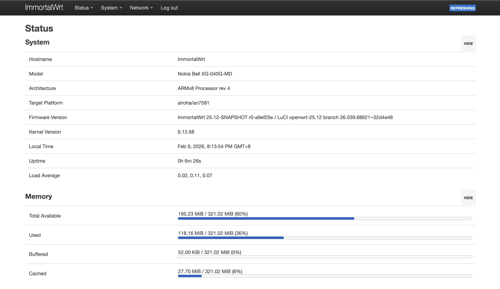
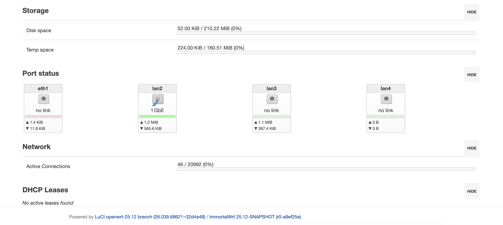

# OpenWrt for XG-040G-MD

OpenWrt firmware for NOKIA BELL XG-040G-MD

编译脚本基于 [Cairongzeng: Add support Nokia Bell XG-040G-MD](https://github.com/Cairongzeng/openwrt/tree/xg040gmd) , [Actions-OpenWrt](https://github.com/xuxin1955/Actions-OpenWrt) 修改。

* 固件使用 OpenWrt/Immortalwrt 25.12-snapshot 分支构建，包含 luci，不包含中文语言包及其他不必要的包，与其他常见的官方 image 类似，尽可能保持小体积。
* 使用 tcboot.bin 作为引导程序。
* Snapshot 分支变化频繁，固件刷入后，有一定几率无法成功启动。
* **请准备好 USB-TTL，做好随时救砖的准备**。

## 目前遇到的问题
* 网口指示灯不亮

## Immortalwrt Snapshots

