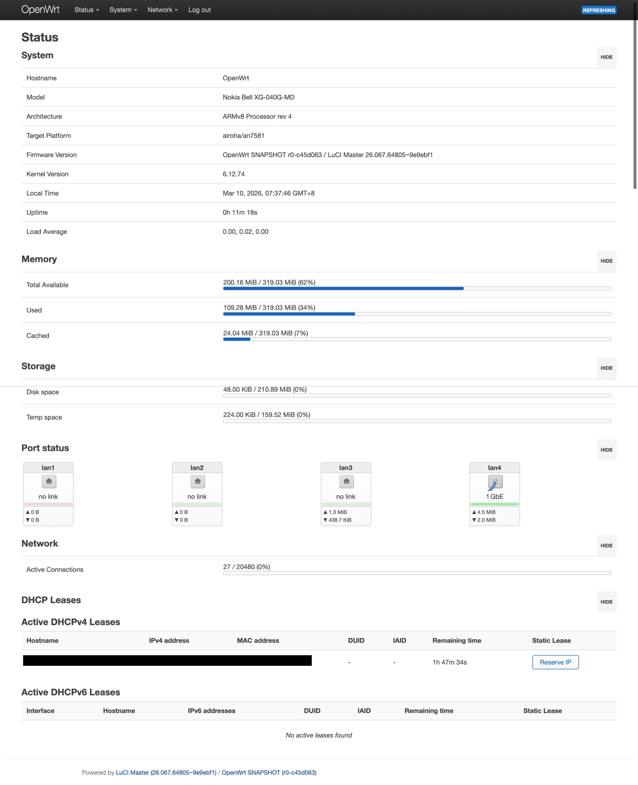

# OpenWrt for XG-040G-MD

OpenWrt firmware for NOKIA BELL XG-040G-MD

编译脚本基于 [Actions-OpenWrt](https://github.com/xuxin1955/Actions-OpenWrt) 修改。

* 固件使用 OpenWrt main 分支构建，包含 luci，不包含中文语言包及其他不必要的包，与其他常见的官方 image 类似，尽可能保持小体积。
* 使用 tcboot.bin 作为引导程序。
* main 分支变化频繁，固件刷入后，有一定几率无法成功启动。
* **请准备好 USB-TTL，做好随时救砖的准备**。

## 关于 NAND Flash

XG-040G-MD 使用的 NAND Flash 主要有两个型号：
* SkyHigh S35ML02G300
* Fudan Micro FM25G02B: 晚期生产的，用此型号的较多。

> OpenWRT 对两者的支持程度有差异。如果使用时遇到 NAND 相关问题，请先确认 NAND Flash 型号，再排查问题。

## 问题

* 最新的 main 分支已支持 NOKIA BELL XG-040G-MD，但是没有一个简单易刷入的固件。**操作不当很容易变砖**。

## OpenWrt Snapshots

